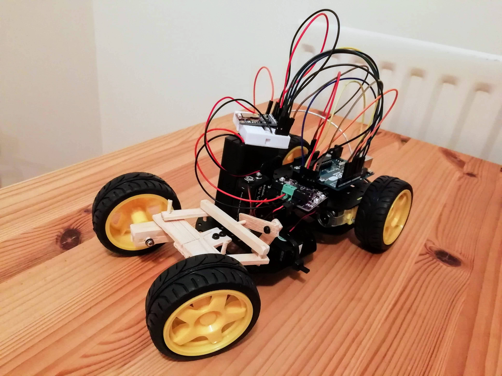

# Bluetooth-Arduino-Car
Smartphone Controlled Arduino Car via Bluetooth

<!-- PROJECT LOGO -->
 

  <h3 align="center">Bluetooth-Arduino-Car</h3>

  

    Bluetooth Arduino Car
     
    <a href="https://github.com/halldorstefans/Bluetooth-Arduino-Car"><strong>Explore the docs »</strong></a>
     
     
    <a href="https://github.com/halldorstefans/Bluetooth-Arduino-Car">View Demo</a>
    ·
    <a href="https://github.com/halldorstefans/Bluetooth-Arduino-Car/issues">Report Bug</a>
    ·
    <a href="https://github.com/halldorstefans/Bluetooth-Arduino-Car/issues">Request Feature</a>
  

<!-- TABLE OF CONTENTS -->
## Table of Contents

* [About the Project](#project-name)
  * [Built With](#built-with)
* [Setup](#setup)
* [License](#license)
* [Contact](#contact)
* [Acknowledgements](#acknowledgements)

<!-- ABOUT THE PROJECT -->
## Bluetooth-Arduino-Car

Project for a smartphone-controlled Arduino car with the Adafruit Bluefruit LE UART Friend.

### Built With

* [Arduino](https://www.arduino.cc/)
* [Adafruit Bluefruit LE UART Friend](https://learn.adafruit.com/introducing-the-adafruit-bluefruit-le-uart-friend)
* [Maker Drive](https://www.cytron.io/p-maker-drive-simplifying-h-bridge-motor-driver-for-beginner)
* [Ultrasonic Distance Sensor (HC-SR04)](https://www.osepp.com/electronic-modules/sensor-modules/62-osepp-ultrasonic-sensor-module)

<!-- GETTING STARTED -->
## Setup

See articles about how to [build a smartphone-controlled Arduino car with the Adafruit Bluefruit LE UART Friend](https://www.engineeracar.com/bluetooth-arduino-car/) and [add a HC-SR04 Ultrasonic Sonar Distance Sensor to your robot car project](www.engineeracar.com/hc-sr04-distance-sensor/ ).

<!-- LICENSE -->
## License

Distributed under the MIT License. See `LICENSE` for more information.

<!-- CONTACT -->
## Contact

Halldor Stefansson - [@engineer_a_car](https://twitter.com/engineer_a_car) - halldor@engineeracar.com

Project Link: [https://github.com/halldorstefans/Bluetooth-Arduino-Car](https://github.com/halldorstefans/Bluetooth-Arduino-Car)

<!-- ACKNOWLEDGEMENTS -->
## Acknowledgements
* [Adafruit Bluefruit library](https://github.com/adafruit/Adafruit_BluefruitLE_nRF51)
* [Cytron Motor Driver library](https://github.com/CytronTechnologies/CytronMotorDriver)
* [Arduino Forum](https://forum.arduino.cc/t/servo-and-dc-motor-working-at-the-same-time/341985)
* [Arduino Project Hub - abdularbi17](https://create.arduino.cc/projecthub/abdularbi17/ultrasonic-sensor-hc-sr04-with-arduino-tutorial-327ff6)
